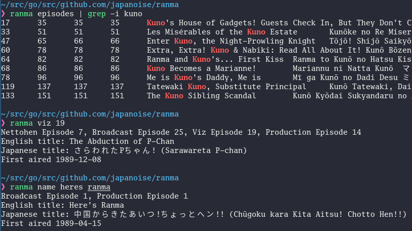

# ranma: Ranma ½ episode search utility



Exactly what it says on the tin!

```
Usage: ranma <COMMAND> [ARG]...

Commands are:
	nettohen	(Alias "nh") Find episode by Nettohen number.
	broadcast	(Alias "bc") Find episode by broadcast order.
	production	(Alias "prod") Find episode by production order.
	viz	Find episode by Viz home release order.
	name	Find episode by English name (fuzzy find)
	rjname	Find episode by Japanese (romaji) name (fuzzy find)
	episodes	 List episodes as tab-separated data
	help	(Alias "usage") Display this message.
```
